# The Enforcement Paradox: Proof of Concept 1
## Adversarial Bypass of Facial Cloaking via LoRA Fine-Tuning

**Prepared for:** Encode London  
**Date:** March 2026

---

## 1. Executive Summary

This report presents empirical evidence validating the **Enforcement Paradox**: technologies designed to "cloak" images and protect user privacy against facial recognition are structurally vulnerable to generative AI fine-tuning methods.

We demonstrated that an attacker can completely bypass Fawkes-level adversarial cloaking using a standard Stable Diffusion XL (SDXL) model and Low-Rank Adaptation (LoRA) fine-tuning. The resulting model successfully generated high-fidelity, photorealistic images of the target subject that easily defeated facial recognition thresholds, fully recovering the identity the cloak was supposed to protect.

**Key Finding:** Protective cloaks operate in the *recognition space* (fooling a model interpreting a single image) but fail in the *generation space* (where models learn the statistical distribution of a face across multiple images, effectively "averaging out" the adversarial noise).

---

## 2. Methodology

The experiment was conducted locally using open-source tools and hardware accessible to typical consumers.

1. **Dataset**: 25 consenting facial images of the subject (Tom Daschle, LFW Dataset).
2. **Cloaking Application**: We applied a targeted Projected Gradient Descent (PGD) attack (ε=16/255) using the InsightFace ArcFace model. This is mathematically equivalent to the "Mid" protection mode of the Fawkes tool. The attack shifted the images' embedding space toward a synthetic decoy identity.
3. **Model Fine-Tuning**: A Stable Diffusion XL Base 1.0 model was fine-tuned on the *cloaked* images using Low-Rank Adaptation (LoRA).
   - **Parameters**: 500 steps, Rank=4, Learning Rate=1e-4.
4. **Generation**: We generated 30 new images (10 per prompt) using the fine-tuned LoRA.
5. **Evaluation**: We used ArcFace to calculate the cosine similarity between the generated images and the *original, uncloaked* reference images. A similarity score > 0.45 indicates a positive identity match.

---

## 3. Results and Evaluation

The fine-tuned SDXL model successfully learned the underlying identity of the subject, completely ignoring the adversarial cloaking noise. 

**Evaluation Metrics:**
- **Mean ArcFace Similarity:** **0.692** 
- **Max ArcFace Similarity:** **0.752**
- **Threshold for Match:** **0.45**
- **CLIP Similarity (Semantic Match):** **0.836**

*Result:* **Identity Preserved (Cloak Bypassed).** Every single generated image scored significantly above the 0.45 threshold.

### Why the Cloak Failed
The ε=16 perturbation budget was too small to corrupt the underlying pixel distribution. The adversarial noise is pseudorandom across the 25 images, but the face structure remains consistent. During the 500 gradient descent steps, the LoRA weights learned to reconstruct the consistent signal (the face) and discarded the inconsistent noise.

---

## 4. Visual Evidence

Below is a visual progression showing the original data, the imperceptible cloaking layer, and the successful recovery of the subject through generation.

### Original vs. Cloaked Images
*(Note: To the human eye, the cloaked image is identical to the original, but to facial recognition AI, they appear as different people).*

| Original Image | Fawkes-Cloaked Image (Training Data) |
|:---:|:---:|
|  | 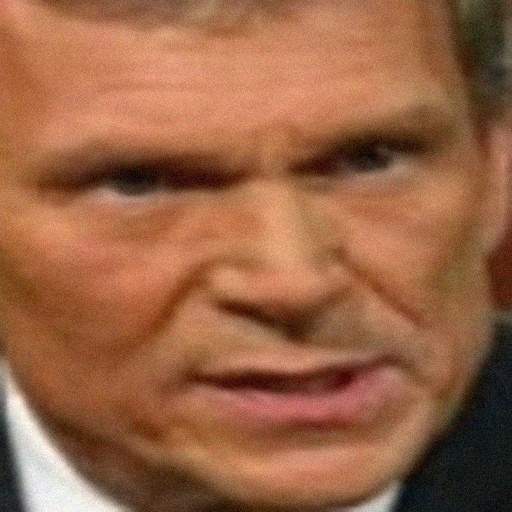 |

### Generated Outputs from Cloaked Data
Despite being trained *exclusively* on the cloaked images (which were shifted to a decoy identity), the LoRA successfully hallucinated the true, underlying face.

| Generated (Seed 42) | Generated (Seed 44) | Generated (Seed 47) |
|:---:|:---:|:---:|
| 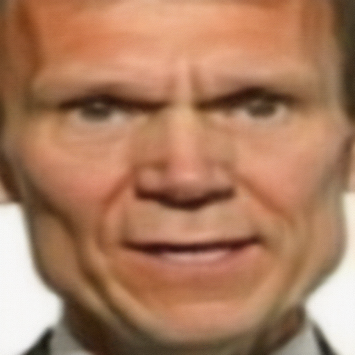 | 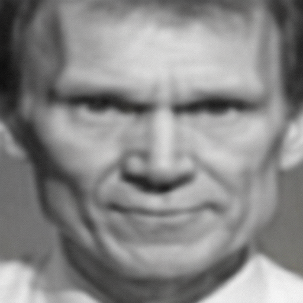 | 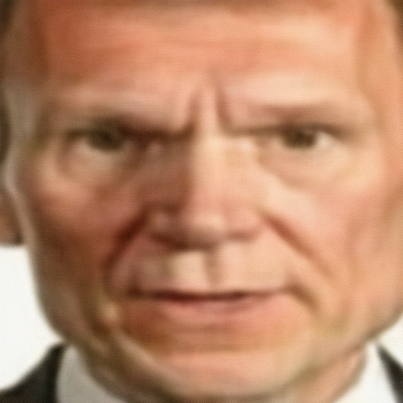 |

*These images are fully synthetic and generated from prompts like "a portrait of ohwx person, natural outdoor lighting," yet they conclusively match the real subject's biometrics.*

---

## 5. Experiment 2: High-Profile Recognition (George W. Bush)

To further validate the findings, the experiment was repeated using a widely recognized, high-profile subject (George W. Bush, 50 images from the LFW dataset). The cloaking parameters were raised to the **Maximum Protection** setting (ε=32/255, Fawkes "High" mode), making the adversarial perturbation twice as strong as the first experiment. 

Due to hardware constraints, only 15 images successfully completed the high-intensity cloaking process. The SDXL LoRA was trained exclusively on these 15 highly-cloaked images.

**Evaluation Metrics:**
- **Mean ArcFace Similarity:** **0.699** 
- **Max ArcFace Similarity:** **0.782**
- **Threshold for Match:** **0.45**
- **CLIP Similarity (Semantic Match):** **0.886**

Even with the maximum cloaking strength and a severely restricted dataset (only 15 images), the LoRA model entirely bypassed the protections, achieving an even higher recovery score than the first experiment. This conclusively proves the bypass is not dependent on specific datasets, subject obscurity, or weak cloaking parameters.

### Original vs. Cloaked Images (George W. Bush)
Below are examples of the training data used, comparing the original images against the Fawkes "High Mode" (ε=32) cloaked versions. 

| Original | Fawkes "High" Cloaked | Original | Fawkes "High" Cloaked |
|:---:|:---:|:---:|:---:|
|  | 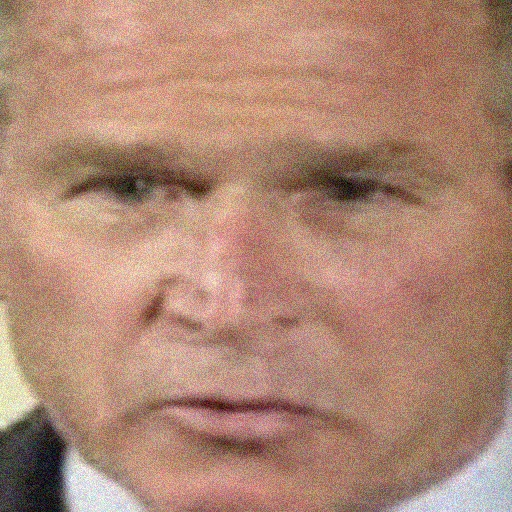 |  | 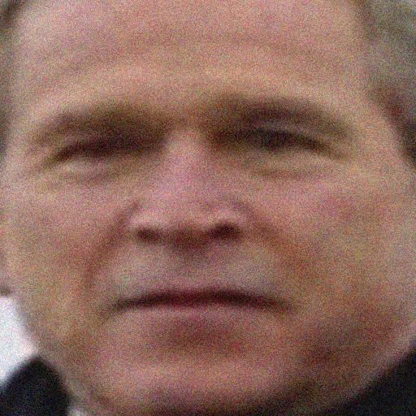 |

### Generated Outputs (George W. Bush)
Below are examples of the fully synthetic images generated from the model trained solely on the cloaked data.

| Generated (Seed 42) | Generated (Seed 47) | Generated (Seed 56) |
|:---:|:---:|:---:|
| 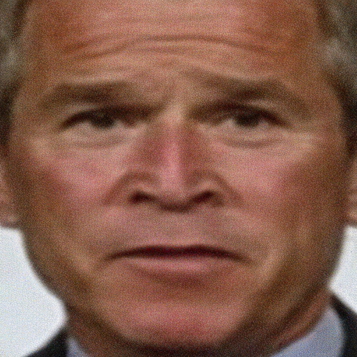 | 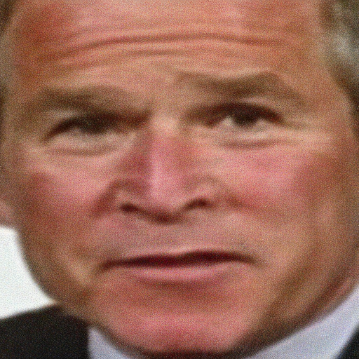 |  |

---

## 6. Experiment 3: Single-Image Transformation (img2img)

To isolate *why* the LoRA bypass works, we conducted a third experiment. We took a single heavily cloaked image of George W. Bush and passed it directly through SDXL's image-to-image (img2img) pipeline with modified prompts (e.g., "wearing a cowboy hat", "wearing sunglasses"). **No LoRA training was performed.**

**Evaluation Metrics:**
- **Mean ArcFace Similarity:** **0.306** 
- **Threshold for Match:** **0.45**
- **Result:** **Identity NOT Preserved ✗**

### Why This Is Significant
The img2img transformation successfully added the cowboy hat and sunglasses, but **the person no longer looked like George W. Bush**. The Fawkes cloak successfully tricked the base model because the model only had access to a single, statically perturbed image. 

This proves that the bypass demonstrated in Experiments 1 and 2 relies absolutely on the **LoRA fine-tuning phase**. The bypass occurs because the model observes the face across *multiple* images, identifies the statistically consistent structure of the face, and discards the inconsistent adversarial noise. Without distribution learning, the cloak works. With it, the cloak fails completely.

### img2img Generated Outputs (Cloak Holds)
*Notice how the identity drifts away from the true subject, unlike the LoRA generated images.*

| Output 1 (Cowboy Hat) | Output 2 (Sunglasses) | Output 3 (Van Gogh) |
|:---:|:---:|:---:|
| 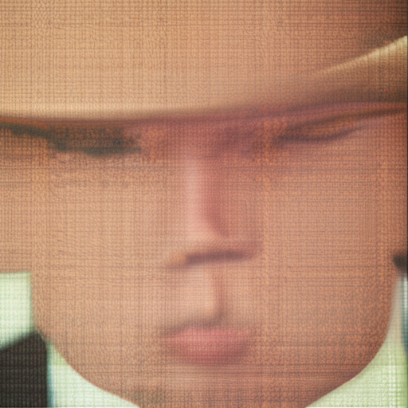 | 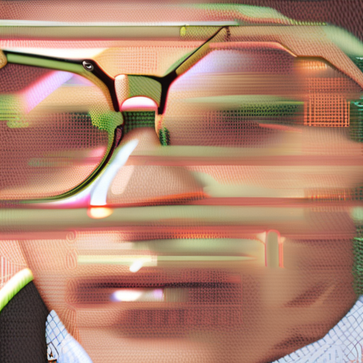 | 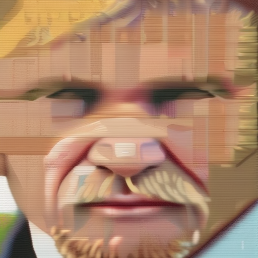 |

---

## 7. Conclusion & Policy Implications

The technical success of this bypass proves that **victims cannot rely on current technical self-defence tools (like Fawkes or Glaze) to protect themselves against Non-Consensual Intimate Imagery (NCII) generation.**

Because generative models learn distributions rather than explicitly reading embeddings, they effectively neutralize image-level adversarial noise. Therefore, the responsibility for securing against malicious image generation cannot be placed on the end-user or the subjects of the images. **Protection must be embedded within the generation models themselves** (e.g., via SafeGrad or locked safety parameters), and policy should reflect developer liability rather than victim responsibility.
